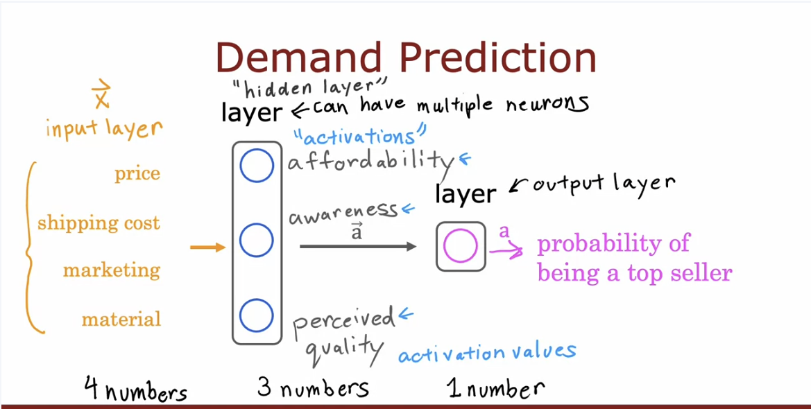
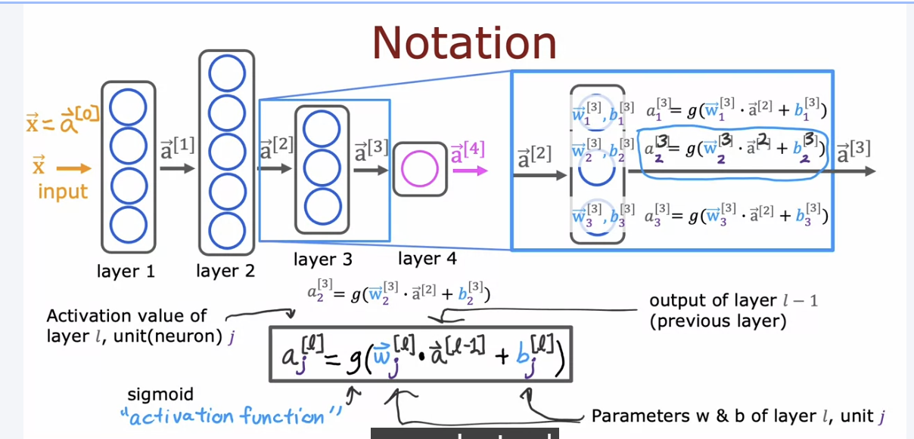

# Why neural network

1. **Better performance with more data**
   - Traditional ML (linear/logistic regression) has a limited number of
     parameters → fitting capacity is capped, no matter how much data you feed it
   - 例子: XOR 问题——经典案例,说明"参数少 = 表达能力封顶"

     | x1 | x2 | y |
     |----|----|---|
     | 0  | 0  | 0 |
     | 0  | 1  | 1 |
     | 1  | 0  | 1 |
     | 1  | 1  | 0 |

     $z = w_1 x_1 + w_2 x_2 + b$ 是线性的,无法拟合 XOR(非线性可分)

2. **计算上适配硬件**: 神经网络本质是大量矩阵乘法运算,GPU 的并行计算能力刚好适合这种计算模式

# Layers

# Weights
The params we multiply are called weights.
# Biases
The prams we add are called Biases.